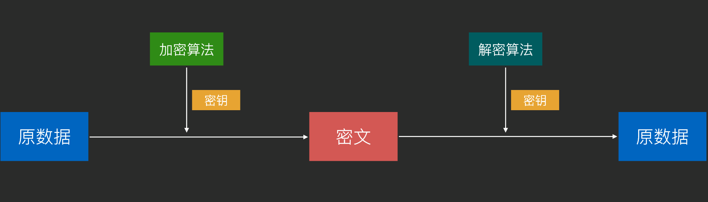
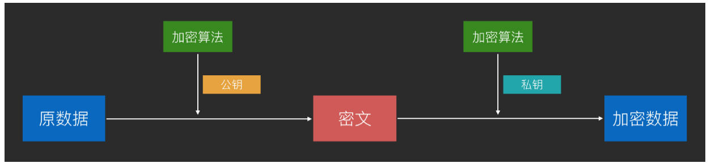
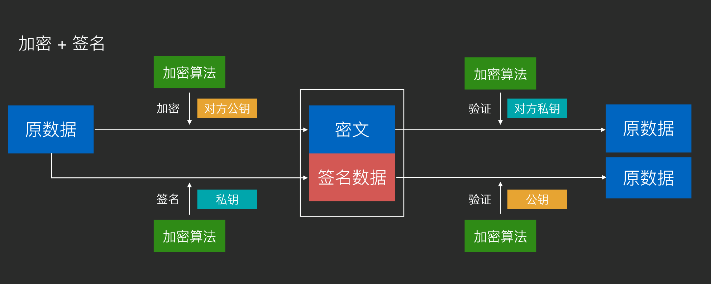

### 一.HTTP协议

#### 1.定义

Http是一种网路传输协议，位于TCP/IP协议族的最顶层--应用层，全称：hyperText Transfer Protocol（超文本传输协议）。

**HTTP的工作方式**：

1.浏览器：用户输入地址回车，或者点击链接->浏览器拼装HTTP报文发送请求给服务器->服务器处理请求后发送响应报文给浏览器->浏览器解析报文，并使用渲染引擎显示到界面

2.手机App：用户点击或者界面触发联网需求->android 客户端代码调用拼装HTTP报文发送请求到服务器->服务器处理请求后发送响应报文给手机->android客户端处理响应报文，作出处理（如存储，加工，显示）

#### 2.URL和HTTP报文

**1.URL格式**

URL主要由三部分组成：协议类型，服务器地址（和端口号），路径（Path）

组成如下：协议类型://服务器地址[:端口号]/路径

如：http://hencoder.com/user?gender=male

**2.报文格式**

请求报文的格式：

GET /users HTTP/1.1       -------------------->请求行，包括method，path，http version

Host:api.github.com       --------------------->Headers

Content-Type:text/plain

Content-Length

Body............................         ---------------->请求body

响应报文的格式：

HTTP/1.1 200 OK                       ---------------------------->状态行，包括http version，状态码，状态消息（无所谓）

content-type:application/json;charset=utf-8                     ---------------------------->Headers

cache-control:public,max-age=60,s-maxage=60

vary:Accept,Accept=Encoding

etag:W/"542d5k-288u043it96-5prqou985"


[{...............................................}]                                --------------------------------->响应body

**3.Request Method请求方法**

**GET**

1.用于获取资源

2.对服务器数据不进行修改

3.不发送body

4.具备幂等性（也就是说无论请求多少次，效果一样）

```
GET  /users/1  HTTP/1.1 
Host: api.github.com
```

对应 Retrofit 的代码：

```
@GET("/users/{id}") Call<User> getUser(@Path("id") String id, @Query("gender") String gender);
```

**POST**

1.用于增加或者修改服务器数据

2.发送给服务器的内容写在body里面

```
POST  /users  HTTP/1.1 
Host: api.github.com 
Content-Type: application/x-www-form-urlencoded 
Content-Length: 13

name=rengwuxian&gender=male
```

对应Retrofit的代码

```
@FormUrlEncoded 
@POST("/users")
Call<User> addUser(@Field("name") String name, @Field("gender") String gender);
```

**PUT**

1.用于修改资源

2.发送给服务器的内容写在body里面

```
PUT  /users/1  HTTP/1.1 
Host: api.github.com 
Content-Type: application/x-www-form-urlencoded
Content-Length: 13

gender=female
```

对应Retrofit的代码

```
@FormUrlEncoded 
@PUT("/users/{id}") 
Call<User> updateGender(@Path("id") String id, @Field("gender") String gender);
```

**DELETE**

1.用于删除资源

2.不发送body

```
DELETE  /users/1  HTTP/1.1 
Host: api.github.com
```

对应Retrofit的代码

```
@DELETE("/users/{id}")
Call<User> getUser(@Path("id") String id, @Query("gender") String gender);
```

**HEAD** (可以用来获取资源的大小)

1.和 GET 使⽤用⽅方法完全相同

2.和 GET 唯⼀一区别在于，返回的响应中没有 Body 


#### 3.状态码：Status Code

三位数字，⽤用于对响应结果做出类型化描述（如「获取成功」「内容未找到」）。
1xx：临时性消息。如：100 （继续发送）、101（正在切换协议） 

2xx：成功。最典型的是 200（OK）、201（创建成功）。

3xx：重定向。如 301（永久移动）、302（暂时移动）、304（内容未改变）。 

4xx：客户端错误。如 400（客户端请求错误）、401（认证失败）、403（被禁⽌止）、404（找 不不到内容）。

5xx：服务器器错误。如 500（服务器器内部错误）。

#### 4.Header 首部 

作用：HTTP消息的metadata

**Host**: 目标主机，（注意：不是在网络上用于寻址的，而是在目标服务器上定位子服务器的，而网络寻址则是DNS负责寻址主机的IP地址）

**Content-Type**：指定body的类型，主要有四类

1.text/html ： 返回html格式文本

2.x-www-form-urlencoded ：Web 页面纯文本表单的提交方式

3.multitype/form-data ：Web 页面含有二进制文件时的提交方式

4.application/json,image/jpeg,application/zip : 单项内容（文本或者非文本都可以），用于web api的响应或者POST,PUT请求

**Content-Length**：指定body的长度（字节）

**Transfer：chunked（分块传输编码Chunked Transfer Encoding）**：

用于当响应发起时，内容长度还没能确定的情况下，和Content-Length不能同时使用，主要是尽早给出响应，减少用户等待时间

**Location**：指定重定向的目标URL

**User Agent**：用户代理，即是谁发起的请求和接受的响应，如手机浏览器

**Range/Accept-Range**: 按范围区数据，主要用于断点续传，多线程下载

```
Accept-Range:bytes 响应报文出现，表示服务器支持按字节来取范围数据
Range：bytes=<start>-<end> 请求报文中出现，表示要取哪段数据
Content-Range：<start>-<end>/total 响应报文中出现，表示发送的是哪段数据
```

**其他 Headers** 

Accept: 客户端能接受的数据类型，如 text/html 

Accept-Charset: 客户端接受的字符集。如 utf-8

Accept-Encoding: 客户端接受的压缩编码类型。如 gzip 

Content-Encoding：压缩类型。如 gzip

**Cache** 

作用：在客户端或中间网络节点缓存数据，降低从服务器取数据的频率，以提高网络性能

**REST** 

REST 的定义众说纷纭，没有统一答案。
扔物线的观点：REST HTTP 即正确使用 HTTP。

包括：
1.使用资源的格式来定义 URL

2.规范地使用 method 来定义网络请求操作 

3.规范地使用 status code 来表示响应状态 

4.其他符合 HTTP 规范的设计准则

### 二.编码，加密，hash

#### 1.对称加密

**原理**：使用密钥和加密算法对数据进行转换，得到的无意义数据即为密文；使用密钥和解密算法对密文进行逆向转换，得到原数据

**经典算法**：DES(56位),AES（128位，192位，256位密钥，现在最流行）



**作用**：加密通信，防止信息在不安全网络上被截获后，信息被读取或者篡改

**缺点**：不能在不安全网络上传输密钥，一旦密钥泄漏，加密通信就失败

#### 2.非对称加密

**原理**：使用对方公钥对数据进行加密得到密钥；使用私钥对数据进行解密得到原数据

使用非对称加密通信，可以在不可信网络上将双方的公钥传给对方，然后在发消息前分别对消息使用对方的公钥来加密和使用自己的私钥来签名。



由于公钥和私钥相互可解，因此非对称加密可以用于数字签名技术



**经典算法**：RSA(可用于加密和签名)，DSA(仅用于签名，但速度更快)

**优点**：可以在不安全网络上传输密钥

**缺点**：计算复杂，性能比对称加密差很多